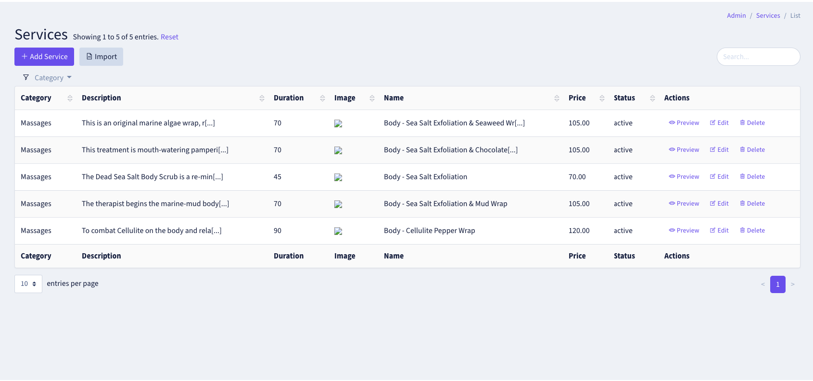
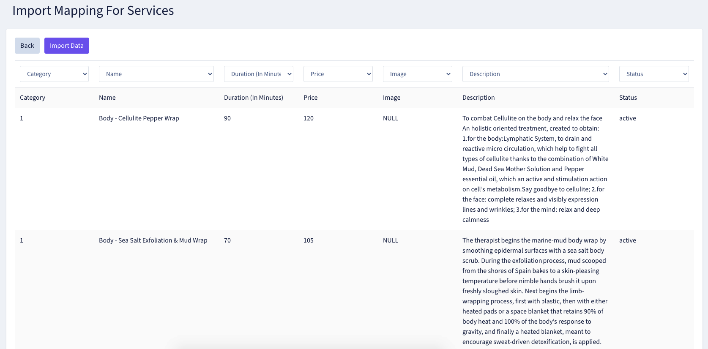

# Backpack import

## Install

1) This package assumes you've already installed [Backpack for Laravel](https://backpackforlaravel.com). If you haven't, please [install Backpack first](https://backpackforlaravel.com/docs/3.5/installation).

2) In your terminal:

``` bash
composer require ckhandla94/backpack-import
```

2) Run its migrations. Publish its config files. Most likely it's:
```bash
php artisan vendor:publish --provider="BackpackImport\BackpackImportServiceProvider"
php artisan migrate
```

## Usage in your controller

Here's a simple example to use in your controller:

```
...
class ExampleCrudController extends CrudController
{
    ...
    use \BackpackImport\ImportOperation;

    public function importValidationRules()
    {
        return [
            'category_id' => 'required|exists:categories,id',
            'name'        => 'required|max:255',
            'duration'    => 'nullable|numeric',
            'price'       => 'nullable|numeric',
            'image'       => 'nullable',
            'description' => 'nullable|max:5000',
            'status'      => 'required',
        ];
    }
    ....

```

## Preview
### Import button in List page


### Import page or Download sample file


### Preview of the uploaded file and Maping with database

